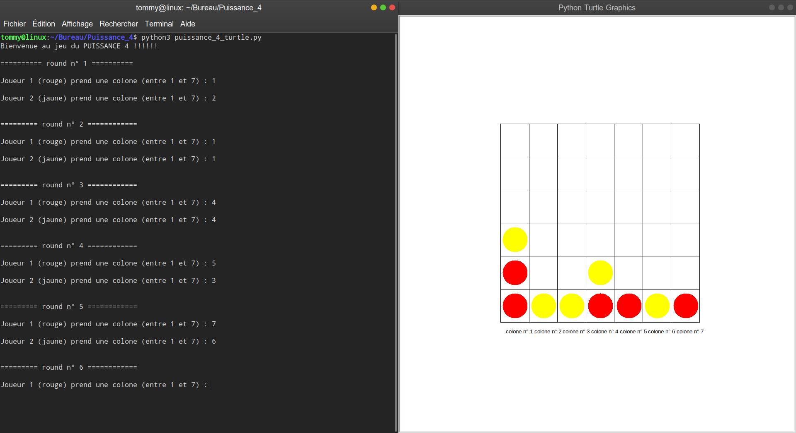

# Power 4

This project is the game of Power 4. 

I did it in 2018, during my 2nd year of university license. This is a personnal project, and is developed in Python3. This project is finished.

## Rules
To win a game of power 4, you just have to be the first to align 4 chips of its color horizontally, vertically and diagonally.

## To begin
Do the command :  `$ git clone https://github.com/debroucker/power_4.git` to recover this repository.

## Prerequisite
You need to have Python3.
So, if you haven't it, do the command : `$ sudo apt-get install python3`

## Start-up
To launch the game, do the command : `$ python3 src/puissance_4_turtle.py` in the main directory, and enjoy.

## Made with
Visual Studio Code

## Authors
DEBROUCKER Tommy
